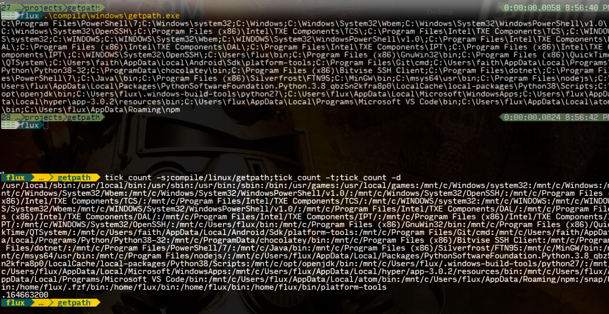

# GetPath - Cross Platform - Fortran

Get the ***PATH*** variable contents in both ***Windows*** and ***Linux*** using a ***Fortran*** executable.

## Index

1. [Usage](#usage)
   1. [Windows](#windows)
      1. [CMD](#cmd)
      2. [PowerShell](#powershell)
   2. [Linux](#linux)
      1. [Shell](#shell)
2. [Motivation](#motivation)
3. [Files](#files)
4. [Help with Mac](#machelp)
5. [ScreenShot](#screen)
6. [License](#license)

## Usage <a name="usage"></a>

This is a command line interface (CLI) utility. If this utitlity is anywhere in path then you can run this without the need for the full path.

### Windows <a name="windows"></a>

#### CMD <a name="cmd"></a>

```CMD
 > REM In path:
 > getpath
 > REM or
 > getpath.exe
 > REM Not in path:
 > "C:\full\path\to\getpath.exe"
 > REM replaces:
 > echo %PATH%
 > REM and can be used in any script or other
 > REM program that can execute or call this.
```

#### PowerShell <a name="powershell"></a>

```PowerShell
 > # In path:
 > getpath
 > # or
 > & 'getpath.exe'
 > # Not in path:
 > & 'C:\full\path\to\getpath.exe'
 > # replaces:
 > $Env:PATH
 > # and can be used in any script or other
 > # program that can execute or call this.
```

### Linux <a name="linux"></a>

#### Shell/Bash/ZSH/Anything <a name="shell"></a>

```Bash
 $ # In path:
 $ getpath
 $ # Not in path:
 $ /path/to/getpath
 $ # or relative:
 $ ./path/to/getpath
 $ # replaces:
 $ echo $PATH
 $ # and can be used in any script or other
 $ # program that can execute or call this.
```

## Motivation <a name="motivation"></a>

I wanted a different way to get the path on any operating system for use with other various tools.

## Files <a name="files"></a>

This is a ***[FOSS](https://en.wikipedia.org/wiki/Free_and_open-source_software)*** project.

- [Source Archive](./source.7z)
- [Windows - Compiled Executable](./compile/windows/getpath.exe)
- [Linux -Compiled Executable](./compile/linux/getpath)
- [This Repository](https://github.com/Lateralus138/getpath-crossplatform-fortran)
- [Project Release](https://lateralus138.github.io/getpath-crossplatform-fortran/)

## Help with Mac <a name="machelp"></a>

This is currently only compiled in Windows and Linux. If someone is interested in this in ***Mac***/***Apple*** it should run the same and just needs to be compiled.
I'm pretty sure you can compile in Apple the same way you would with their version of ***gfortran***:

```Bash
 $ # Assuming Bash/Shell in Terminal
 $ gfortran getpath.f95 -o getpath
```
Please feel free to fork or make a pull request; whatever you want.

## Screenshot <a name="screen"></a>

This is the command in each environment being benchmarked.



## [License](./LICENSE) <a name="license"></a>

>This program is free software: you can redistribute it and/or modify it under the terms of the GNU General Public License as published by the Free Software Foundation, either version 3 of the License, or (at your option) any later version.

>This program is distributed in the hope that it will be useful, but WITHOUT ANY WARRANTY; without even the implied warranty of MERCHANTABILITY or FITNESS FOR A PARTICULAR PURPOSE.  See the GNU General Public License for more details.